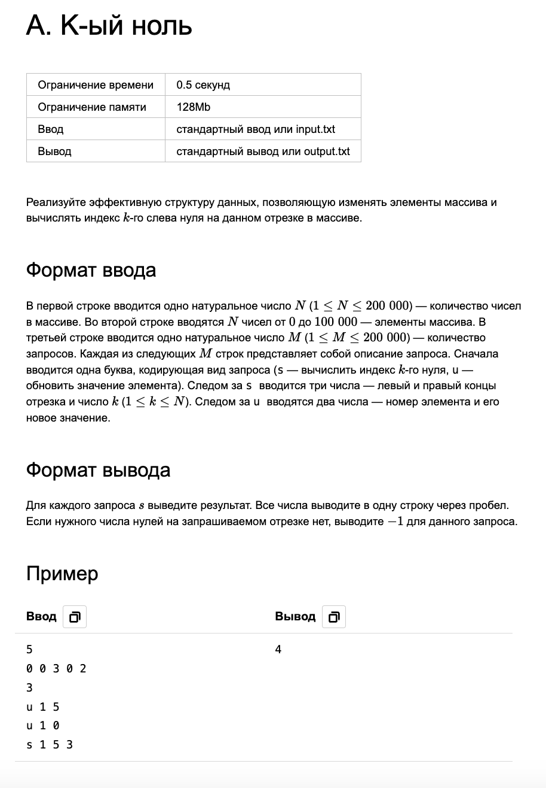

# A. K-ый ноль
<table>
    <tr>
        <th>Ограничение времени</th>
        <th>Ограничение памяти</th>
        <th>Ввод</th>
        <th>Вывод</th>
    </tr>
    <tr>
        <td>0.5 секунд</td>
        <td>128Mb</td>
        <td>стандартный ввод или input.txt</td>
        <td>стандартный вывод или output.txt</td>
    </tr>
</table>

Реализуйте эффективную структуру данных, позволяющую изменять элементы массива и вычислять индекс k-го слева нуля на данном отрезке в массиве.

## Формат ввода

В первой строке вводится одно натуральное число N
(1 ≤ N ≤ 200 000) — количество чисел в массиве. Во второй строке вводятся
N чисел от 0 до 100 000 — элементы массива. В третьей строке вводится одно натуральное число 
M (1 ≤ M ≤ 200 000) — количество запросов. Каждая из следующих M строк представляет собой описание запроса. Сначала вводится одна буква, кодирующая вид запроса (s — вычислить индекс
k-го нуля, u — обновить значение элемента). Следом за s вводится три числа — левый и правый концы отрезка и число
k (1 ≤ k ≤ N). Следом за u вводятся два числа — номер элемента и его новое значение.

## Формат вывода

Для каждого запроса s выведите результат. Все числа выводите в одну строку через пробел. Если нужного числа нулей на запрашиваемом отрезке нет, выводите − 1 для данного запроса.

## Пример

<table>
    <tr>
        <th>Ввод</th>
        <th>Вывод</th>
    </tr>
    <tr>
        <td>
5  
0 0 3 0 2  
3  
u 1 5  
u 1 0  
s 1 5 3

</td>
        <td>4</td>
    </tr>
</table>

 

